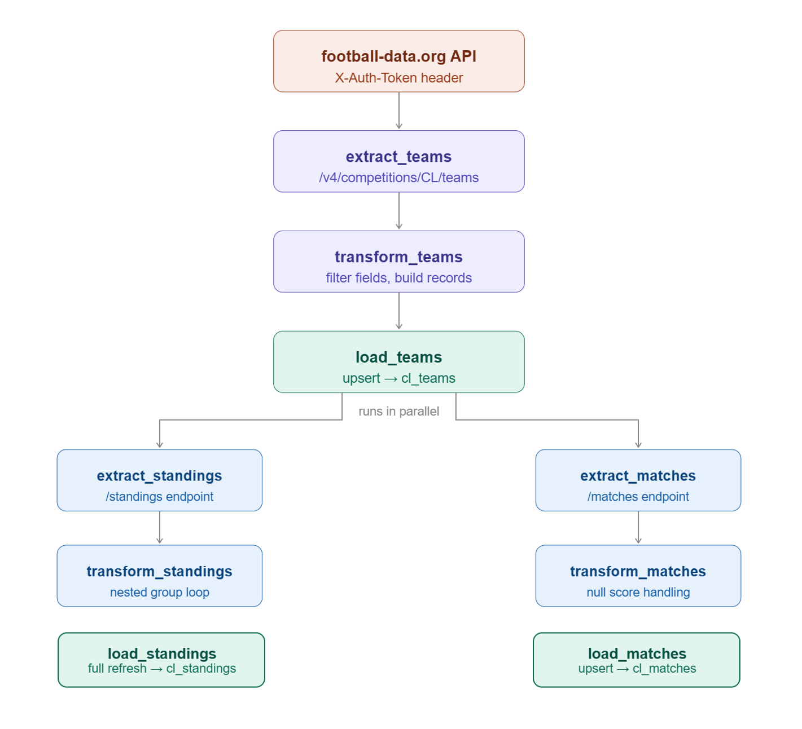

# UEFA Champions League ETL Pipeline

An end-to-end ETL pipeline built with **Apache Airflow** and **Astro CLI** that extracts UEFA Champions League data from the [football-data.org](https://www.football-data.org) API and loads it into a **Neon Postgres** cloud database.

---

## Pipeline Architecture



The pipeline runs three parallel ETL chains:

1. **Teams** — extracted and loaded first (required for foreign key constraints)
2. **Standings** — runs in parallel with matches after teams are loaded
3. **Matches** — runs in parallel with standings after teams are loaded

---

## Tech Stack

| Layer | Tool |
|---|---|
| Orchestration | Apache Airflow (via Astro CLI) |
| Containerization | Docker Desktop |
| Data Source | football-data.org REST API |
| Destination | Neon (serverless Postgres) |
| Language | Python 3.13 |
| Providers | apache-airflow-providers-http, apache-airflow-providers-postgres |

---

## Data Model

Three tables with foreign key relationships:

```
cl_teams (team_id PK)
    ↑                        ↑
cl_standings            cl_matches
(team_id FK)    (home_team_id FK, away_team_id FK)
```

### cl_teams
| Column | Type | Description |
|---|---|---|
| team_id | INT (PK) | Unique team identifier from API |
| team_name | VARCHAR(100) | Full club name |
| short_name | VARCHAR(50) | Short club name |
| tla | CHAR(3) | Three letter abbreviation |
| loaded_at | TIMESTAMP | Row load timestamp |

### cl_standings
| Column | Type | Description |
|---|---|---|
| id | SERIAL (PK) | Auto-generated row ID |
| team_id | INT (FK) | References cl_teams |
| position | INT | League table position |
| played_games | INT | Matches played |
| won / draw / lost | INT | Results breakdown |
| points | INT | Total points |
| goals_for / goals_against | INT | Goals scored and conceded |
| goal_difference | INT | Goal difference |
| stage | VARCHAR(50) | Competition stage |
| group_name | VARCHAR(20) | Group (A–H) |
| season | VARCHAR(10) | Season year |
| loaded_at | TIMESTAMP | Row load timestamp |

### cl_matches
| Column | Type | Description |
|---|---|---|
| id | SERIAL (PK) | Auto-generated row ID |
| match_id | INT (UNIQUE) | Stable match ID from API |
| utc_date | TIMESTAMP | Match date and time (UTC) |
| status | VARCHAR(30) | SCHEDULED, FINISHED, POSTPONED etc. |
| matchday | INT | Matchday number (null for knockout) |
| stage | VARCHAR(50) | Competition stage |
| group_name | VARCHAR(20) | Group name (null for knockout) |
| home_team_id | INT (FK) | References cl_teams |
| home_team_name | VARCHAR(100) | Home club name |
| away_team_id | INT (FK) | References cl_teams |
| away_team_name | VARCHAR(100) | Away club name |
| home_score | INT | Full time home score (null if unplayed) |
| away_score | INT | Full time away score (null if unplayed) |
| winner | VARCHAR(30) | HOME_TEAM, AWAY_TEAM, DRAW, or null |
| loaded_at | TIMESTAMP | Row load timestamp |

---

## Project Structure

```
uefa-champions-league-etl/
├── dags/
│   └── cl_football_pipeline.py   # Main DAG file
├── Dockerfile                     # Astro Runtime image
├── requirements.txt               # Airflow provider packages
├── packages.txt                   # OS-level packages
└── README.md
```

---

## Prerequisites

- [Docker Desktop](https://www.docker.com/products/docker-desktop/) installed and running
- [Astro CLI](https://www.astronomer.io/docs/astro/cli/install-cli) installed
- A free [football-data.org](https://www.football-data.org) account and API key
- A free [Neon](https://neon.tech) account with a Postgres database

---

## Getting Started

### 1. Clone the repository

```bash
git clone https://github.com/Mohamed-gaal/uefa-champions-league-etl.git
cd uefa-champions-league-etl
```

### 2. Create the destination tables in Neon

Run these SQL statements in your Neon SQL editor in order:

```sql
CREATE TABLE cl_teams (
    team_id INT PRIMARY KEY,
    team_name VARCHAR(100),
    short_name VARCHAR(50),
    tla CHAR(3),
    loaded_at TIMESTAMP DEFAULT CURRENT_TIMESTAMP
);

CREATE TABLE cl_standings (
    id SERIAL PRIMARY KEY,
    team_id INT REFERENCES cl_teams(team_id),
    position INT,
    played_games INT,
    won INT,
    draw INT,
    lost INT,
    points INT,
    goals_for INT,
    goals_against INT,
    goal_difference INT,
    stage VARCHAR(50),
    group_name VARCHAR(20),
    season VARCHAR(10),
    loaded_at TIMESTAMP DEFAULT CURRENT_TIMESTAMP
);

CREATE TABLE cl_matches (
    id SERIAL PRIMARY KEY,
    match_id INT UNIQUE,
    utc_date TIMESTAMP,
    status VARCHAR(30),
    matchday INT,
    stage VARCHAR(50),
    group_name VARCHAR(20),
    home_team_id INT REFERENCES cl_teams(team_id),
    home_team_name VARCHAR(100),
    away_team_id INT REFERENCES cl_teams(team_id),
    away_team_name VARCHAR(100),
    home_score INT,
    away_score INT,
    winner VARCHAR(30),
    loaded_at TIMESTAMP DEFAULT CURRENT_TIMESTAMP
);
```

### 3. Start Airflow locally

```bash
astro dev start
```

### 4. Configure Airflow connections

Open the Airflow UI at `http://localhost:8080` (login: `admin` / `admin`) and go to **Admin → Connections**. Create two connections:

**Connection 1 — Neon Postgres**
| Field | Value |
|---|---|
| Conn Id | `postgres_default` |
| Conn Type | `Postgres` |
| Host | Your Neon host (from Neon dashboard connection string) |
| Database | Your Neon database name |
| Login | `neondb_owner` |
| Password | Your Neon password |
| Port | `5432` |
| Extra | `{"sslmode": "require"}` |

**Connection 2 — football-data.org API**
| Field | Value |
|---|---|
| Conn Id | `football_api` |
| Conn Type | `HTTP` |
| Host | `https://api.football-data.org` |
| Extra | `{"X-Auth-Token": "your_api_key_here"}` |

### 5. Trigger the DAG

In the Airflow UI, find `cl_football_pipeline` and click the ▶ play button to trigger a manual run.

---

## DAG Design Decisions

**Why teams load first:** `cl_standings` and `cl_matches` both reference `cl_teams` via foreign keys. Teams must exist in the database before standings and matches can insert rows that reference them. The `>>` operator in Airflow enforces this dependency.

**Why upsert for teams and matches:** Both have stable unique identifiers from the API (`team_id`, `match_id`). Using `ON CONFLICT DO UPDATE` means reruns update existing records rather than failing on duplicates. This also handles the case where a scheduled match gets played and its score needs to be filled in.

**Why full refresh for standings:** Standings represent the current state of the entire league table. Every matchday changes multiple rows simultaneously. A `DELETE` then reload ensures the table always reflects the latest snapshot rather than a mix of old and new values.

**Switching competitions:** Change `COMPETITION_CODE` at the top of the DAG file to any supported competition code (`PL` for Premier League, `BL1` for Bundesliga, `SA` for Serie A, etc.) and the entire pipeline switches automatically.

---

## Notes

- The football-data.org free tier delays live scores — the pipeline captures the latest available data at the time of each run
- Connections are stored in Airflow's metadata database and are not committed to this repository — you must create them manually after cloning
- The pipeline runs daily (`@daily`) by default and can be triggered manually at any time from the Airflow UI

---

## Author

Mohamed — [GitHub](https://github.com/Mohamed-gaal)
